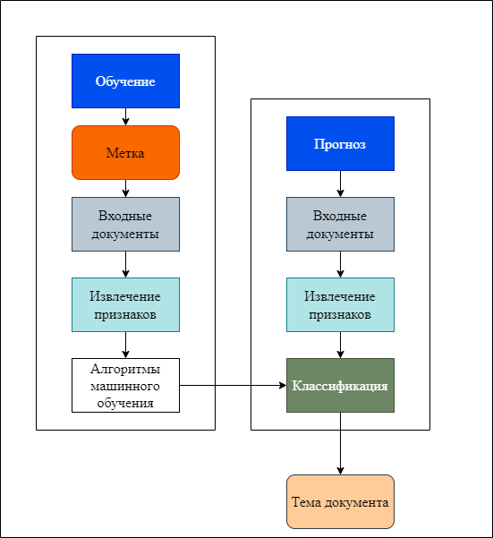
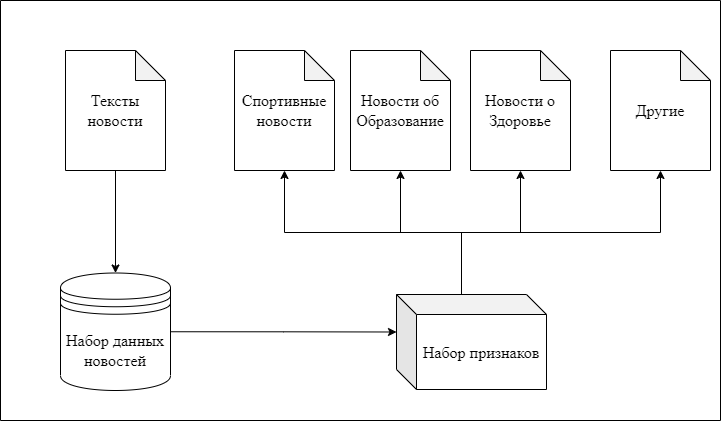

# Тема: Разработка метода опорных векторов для проектирования классификатора новостных текстов 

### 1. Цель работы: 
Разработать программу, способную классифицировать новостные тексты по темам (например Образование, Спорт, Здоровье и т. д.) на основе обработки текста, извлечения признаков и применения машинного обучения (метода опорных векторов) для классификации на основе этих признаков.
### 2. Задачи
- Изучите подход к решению задач машинного обучения и теории классификации в методе опорных векторов.
- Научитесь извлекать особенности из текста новостей
- Разработайте программное обеспечение, которое сможет наиболее точно классифицировать текст.
- Оцените эффективность метода опорных векторов с помощью тестовых данных.
### 3. Формулировка задачи
Дан $x$ - документы, тема которого приладлежит множеству тем $y$ = {1, 2, 3, 4, 5, ..., K}. Нужно найти наиболее подходящую тему для $x$.

Пусть $y = h_{\theta}(x)$ - функция классификации для $x$, где $\theta$ - параметр функции. То нужно найти функцию $y = h_{\theta}(.)$, которая имеет наилучшую классификационную способность. Чтобы найти $y$, можно использовать метод управляемого обучения на выборочных данных:

- Данные обучения состоят из N пар: {$x_{i}, y_{i}$}, где $x_{i}$ - i-й документ, $y_{i}$ - тема документа $x_{i}$.
- Функция $h_{\theta}$ построена так, чтобы наилучшим образом соответствовать этим обучающим данным.

### 4. Модель классификации текста
Общий модель для задачи классификации с помощью машинного обучения:

Применение в задаче классификации текста:

### 5. Применение 
- Классификацию текстов новостей можно использовать в системах мониторинга и обнаружения фейковых новостей.
- Поиск и распространение новостей
